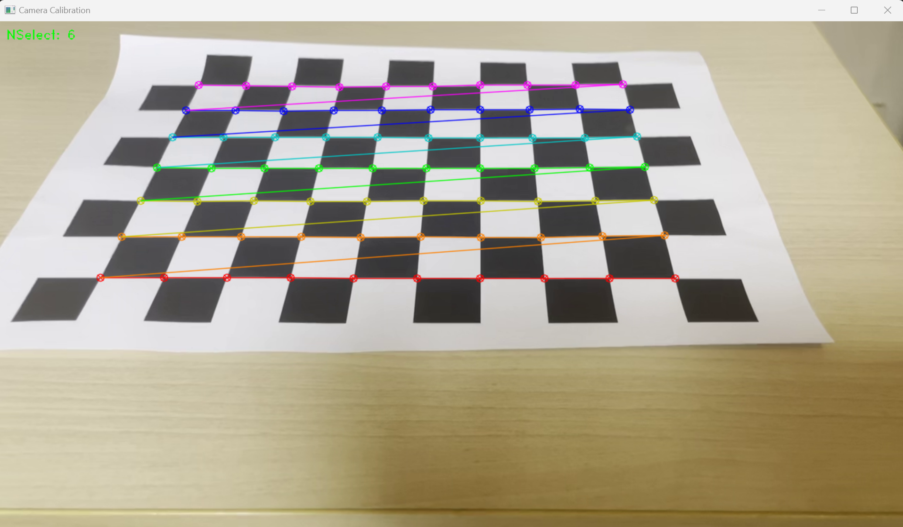
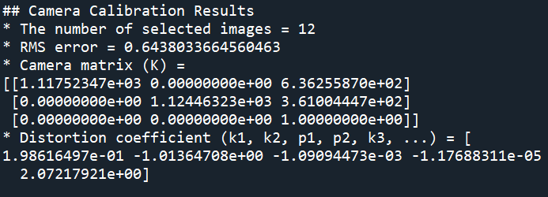
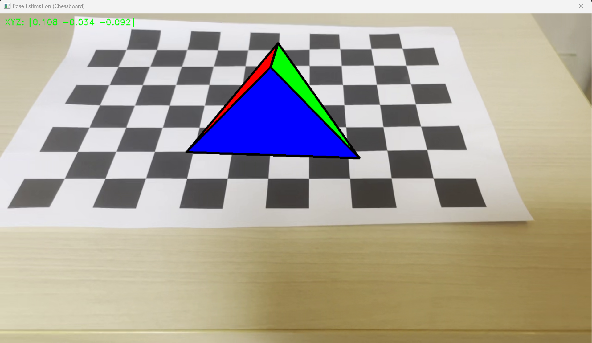

# My_Chessboard
Camera Calibration and Pose Estimation on Chessboard by using OpenCV
****

## 개요

10 x 7 체스보드에 Camera Calibration 과  Pose Estimation을 수행합니다

Camera Calibration는 무작위 각도로 움직이는 Chessboard 영상에 일시정지(Space)키를 눌러 모서리 검출을 하고 Enter키를 눌러 이미지를 저장, K값과 dist_coeff 값을 구합니다.

Pose Estimation은 동일한 영상에 AR 도형을 붙여넣어 Chessboard가 움직일 때 도형도 같이 움직이는 모습을 보여줍니다.

## 실행 화면  

#### 	Camera Calibration

- 실행 화면

  

- 결과값

  

#### 	Pose Estimation

- 실행 화면

  
